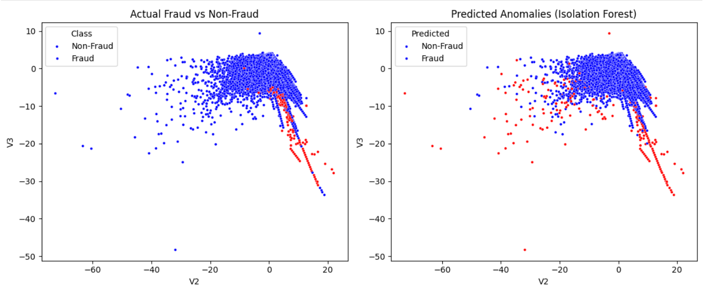

# 💳 Credit Card Fraud Detection using Isolation Forest

This project demonstrates the use of **unsupervised anomaly detection** to identify fraudulent credit card transactions using **Isolation Forest**. It is implemented in Python using Jupyter Notebook, with clear metrics and visualizations to evaluate model performance.

---

## 📌 Project Overview

- 📁 Dataset: [Kaggle – Credit Card Fraud Detection](https://www.kaggle.com/datasets/mlg-ulb/creditcardfraud)
- 🧾 Total Transactions: 284,807
- 🔴 Fraudulent Transactions: 492 (~0.17%)

We address the challenge of detecting rare fraud cases in a highly imbalanced dataset using **Isolation Forest**, which isolates anomalies based on feature values without labeled training.

---

## 🧠 Key Concepts

- Anomaly Detection  
- Unsupervised Learning  
- Class Imbalance Handling  
- Isolation Forest  
- Evaluation Metrics (Confusion Matrix, Precision, Recall, F1)  
- Data Visualization

---

## ⚙️ Technologies Used

- Python 
- Jupyter Notebook  
- Pandas, NumPy  
- Scikit-learn  
- Seaborn, Matplotlib

---

## 📊 Model Evaluation

**Confusion Matrix**:

```
[[284135 180]
[ 387 105]]
```

- **Precision (Fraud class)**: 0.37  
- **Recall (Fraud class)**: 0.21  
- **F1-Score (Fraud class)**: 0.27

✅ The model successfully flagged many true anomalies despite no prior fraud labels during training.

---

## 📷 Visual Results

Visualizations below compare the actual vs predicted fraud cases based on two feature components (`V2`, `V3`):

<p align="center">
  
</p>

- Red points: Fraudulent transactions  
- Blue points: Legitimate transactions

> The predicted anomalies (right) align with true fraud zones (left), validating Isolation Forest’s effectiveness.

---

## 📁 Project Structure

```
credit-card-fraud-detection/
│
├── notebooks/
│ └── fraud_detection.ipynb # Main notebook with full analysis
│
├── visuals/
│ └── download.png # visuals
│
└── README.md # Project documentation
```


---

## 🛠 How to Run

1. **Clone the repository**
```
git clone https://github.com/your-username/credit-card-fraud-detection.git
cd credit-card-fraud-detection
```

2. **Install dependencies**
```
pip install pandas numpy matplotlib seaborn scikit-learn
```

3. **Add the dataset**
Download `creditcard.csv` from Kaggle and place it in the `dataset/` folder.

4. **Launch the notebook**
`jupyter notebook notebooks/fraud_detection.ipynb`

---

## 🙋‍♂️ Author

**Atharva Mirajkar**  
📧 Email: [atharva.r.mirajkar@gmail.com](mailto:atharva.r.mirajkar@gmail.com)  
🔗 GitHub: [lma0lollipop](https://github.com/lma0lollipop)  
🔗 LinkedIn: [mirajkar-atharva](https://www.linkedin.com/in/mirajkar-atharva/)


